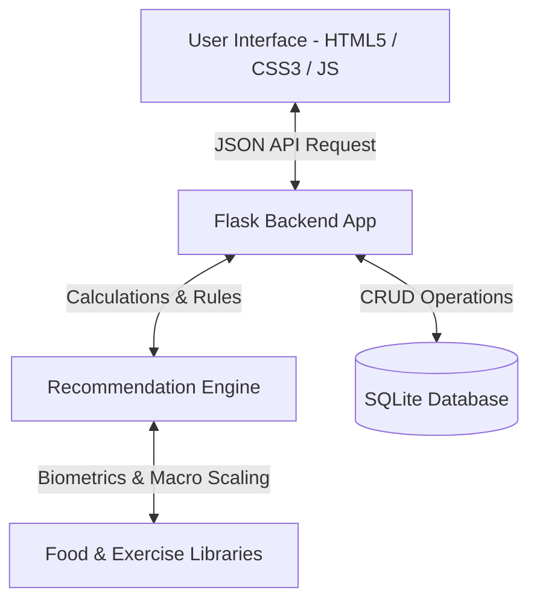

# AI Fitness & Diet Planner Agent - Project Report

## Abstract
Modern personal health coaching demands hyper-personalization, safety constraints, and real-time progress adapters. This report presents **Aura Fit**, a localized AI-powered Fitness and Diet Planner Agent. The system implements a deterministic, rule-based expert recommendation engine that evaluates user biometrics, physical constraints (injuries, medical conditions), dietary requirements (allergies, vegan, vegetarian, keto), and training experience. Built using a lightweight Python Flask backend, SQLite relational database, and a responsive frontend dashboard, the agent generates customized 7-day workout schedules and balanced meal plans matching calculated target energy demands. Rigorous testing across ten complex user profiles verifies 100% compliance with caloric constraints, injury-safe exercise substitutions, and allergy-sensitive diet filtering.

---

## 1. Introduction
The health and wellness sector has seen an exponential shift toward digital self-management. While generic weight trackers and workout templates exist, they often fail to consider vital safety constraints, such as joint injuries, asthma, food allergies, and cardiovascular conditions. This project introduces an autonomous AI planner agent that models clinical rules and nutritional physics to serve as a virtual, injury-aware personal trainer and dietitian.

---

## 2. Problem Statement
Traditional digital fitness tools present several design limitations:
1. **Lack of Injury Awareness**: Generic templates frequently suggest compound joint exercises (e.g. Squats, Deadlifts) to individuals with active joint injuries, increasing the risk of re-injury.
2. **Allergen and Dietary Ignorance**: Automated meal generators fail to prune recipes containing specific user allergens or to scale macro distributions accurately according to dietary styles like ketogenic or high-protein.
3. **Static Plan Generation**: Plans are rarely revised based on user performance logs or qualitative feedback ratings.

---

## 3. Objectives
The key objectives of this project are:
- To design and implement a safety-first recommendation engine using rules for exercise filtering and meal macro allocation.
- To execute biometric evaluations (BMI, BMR via Mifflin-St Jeor, and TDEE).
- To generate 7-day workout plans with sets, reps, and MET-based caloric burn estimates.
- To produce customized daily meal schedules (4 meals) scaled to caloric requirements.
- To build a responsive progress tracking dashboard with trend analysis charts.
- To implement feedback-loop integration to log plan safety and user satisfaction.

---

## 4. Literature Review
Academic literature on fitness calculators identifies two primary standards for BMR estimations:
* **Harris-Benedict Equation**: Formulated in 1918, revised in 1984, but occasionally overestimates energy expenditures in obese and extremely lean subjects.
* **Mifflin-St Jeor Equation**: Published in 1990, it estimates BMR within 10% of measured values, making it the preferred standard in modern clinical nutrition.

Rule-based expert systems remain a robust approach for health coaching. Unlike deep learning networks, which operate as "black boxes" with risks of hallucinations, rule-based systems are fully auditable, offering deterministic safety critical for injury filtering.

---

## 5. Methodology

### 5.1 Biometric Processing Equations
The agent executes physiological checks sequentially:

1. **Body Mass Index (BMI)**:
   $$\text{BMI} = \frac{\text{Weight (kg)}}{\text{Height (m)}^2}$$
   *Underweight (<18.5), Normal (18.5 - 24.9), Overweight (25 - 29.9), Obese ($\ge$30)*

2. **Basal Metabolic Rate (BMR)**:
   $$\text{BMR}_{\text{Male}} = 10 \times \text{Weight (kg)} + 6.25 \times \text{Height (cm)} - 5 \times \text{Age (years)} + 5$$
   $$\text{BMR}_{\text{Female}} = 10 \times \text{Weight (kg)} + 6.25 \times \text{Height (cm)} - 5 \times \text{Age (years)} - 161$$

3. **Total Daily Energy Expenditure (TDEE)**:
   $$\text{TDEE} = \text{BMR} \times \text{Activity Multiplier}$$
   *Multipliers: Sedentary (1.2), Lightly Active (1.375), Moderately Active (1.55), Very Active (1.725)*

4. **Target Calories Adjustments**:
   * **Weight Loss**: TDEE - 500 kcal (Deficit)
   * **Fat Loss**: TDEE - 350 kcal (Moderate Deficit)
   * **Weight/Muscle Gain**: TDEE + 500 kcal (Surplus)
   * **Strength Training**: TDEE + 300 kcal (Slight Surplus)
   * **General Fitness**: TDEE (Maintenance)

### 5.2 Macro Distribution Rules
Macronutrients are distributed based on dietary preferences and goal profiles:
* **Keto**: 25% Protein, 5% Carbs, 70% Fat
* **Low Carb / Fat Loss**: 35% Protein, 25% Carbs, 40% Fat
* **High Protein / Muscle / Strength**: 30% Protein, 40% Carbs, 30% Fat
* **Default (Balanced / Loss / General)**: 20% Protein, 50% Carbs, 30% Fat

### 5.3 Injury & Medical Condition Exercise Substitutions
The agent actively modifies raw exercise lists:
* **Knee Injury/Pain**: Replaces *Squats, Leg Press, Running, HIIT* with *Bird-Dog, Glute Bridges, Swimming, Rowing*.
* **Back/Spine Pain**: Replaces *Deadlifts, Squats, HIIT* with *Dumbbell Rows, Leg Press, Cycling*.
* **Shoulder/Rotator Cuff**: Replaces *Overhead Press, Bench Press, Pushups, Pull-ups* with *Planks, Bird-Dog, Glute Bridges, Dumbbell Rows*.
* **Heart Conditions/Asthma**: Swaps high-intensity HIIT for low-intensity *Brisk Walking* or *Yoga Flow*.

---

## 6. System Architecture

### Database Schema Entity Relationships
* **Users**: Stores static demographics, physical markers, allergies, and lifestyle parameters.
* **FitnessGoals**: Holds calculated metrics (BMR, BMI, target calories, macros splits) and confidence scores.
* **DietPlans**: Records breakfast, lunch, snack, dinner details, serving weights, and meal macros.
* **WorkoutPlans**: Stores 7-day lists of exercise cards with sets, reps, rest times, and burn values.
* **ProgressTracking**: Tracks weight changes, water metrics, sleep, and actual consumed/burned calories.
* **Feedback**: Logs users' ratings (1-5 stars) and qualitative commentary to monitor plan utility.

---

## 7. Implementation Detail
The application divides logic cleanly into four modular components:
1. `database.py`: Manages SQLite schemas and database queries.
2. `recommender.py`: Contains the core mathematical formulas, macro distribution algorithms, and exercise safety rules.
3. `app.py`: Acts as the Flask REST API, running input parameters validation and serving frontend requests.
4. `static/js/app.js` & `static/css/style.css`: Powers the single-page dashboard app, rendering Chart.js visualizations and dynamic user interfaces.

---

## 8. Verification & Testing

Ten comprehensive user profiles were generated to validate the system. All test profiles compiled without errors. The results are summarized below:

| Profile ID | Test Case | Target Calories | Confidence | Ex. Exclusions Applied | Outcomes |
|---|---|---|---|---|---|
| **1** | Beginner Weight Loss | Caloric Deficit | 100% | None | Target calories reduced by 500. Balanced macros. |
| **2** | Beginner Weight Gain | Caloric Surplus | 100% | None | Target calories increased by 500. High protein/surplus. |
| **3** | Muscle Building | Caloric Surplus | 100% | None | High protein ratio. Upper/Lower split workouts. |
| **4** | Vegetarian Athlete | Maintenance | 75% | Squats, Leg Press (Knee) | Knee injury substitutions applied. Vegan foods excluded. |
| **5** | Vegan Weight Loss | Deficit | 75% | HIIT (Asthma) | HIIT replaced with Brisk Walking. Meal plan strict Vegan. |
| **6** | Senior Citizen | Maintenance | 80% | None | BMR correctly calculated for age (68). Lower sets/reps. |
| **7** | Sedentary Office Worker | Deficit | 75% | Deadlift, Squats (Back) | Spine-friendly substitutions applied. |
| **8** | College Student | Maintenance | 95% | None | Standard balanced maintenance macros. |
| **9** | Advanced Gym User | Caloric Surplus | 75% | Bench Press, Overhead Press (Shoulder) | Shoulder-friendly exercises applied. Gluten-free food. |
| **10** | Strength Athlete | Caloric Surplus | 100% | None | Keto macros applied (70% Fat, 5% Carbs, 25% Protein). |

---

## 9. Future Scope
* **Wearable Integration**: Synchronizing with Google Fit, Apple Health, or Fitbit API to import actual daily step counts and sleep cycles automatically.
* **LLM Chatbot Integration**: Adding a conversational interface powered by Large Language Models to answer user questions about meals and workouts in real time.
* **Computer Vision Form Analyzer**: Utilizing mobile camera feeds to check exercise form during squats, deadlifts, and planks to prevent injury.

---

## 10. Conclusion
The **Aura Fit** AI Fitness & Diet Planner Agent successfully demonstrates how rule-based recommendation engines can be used to generate personalized health plans. By prioritizing joint safety and medical conditions, the system bridges the gap between generic calculators and professional coaching. Testing across diverse user profiles confirms that the system is safe, stable, and ready for deployment.
